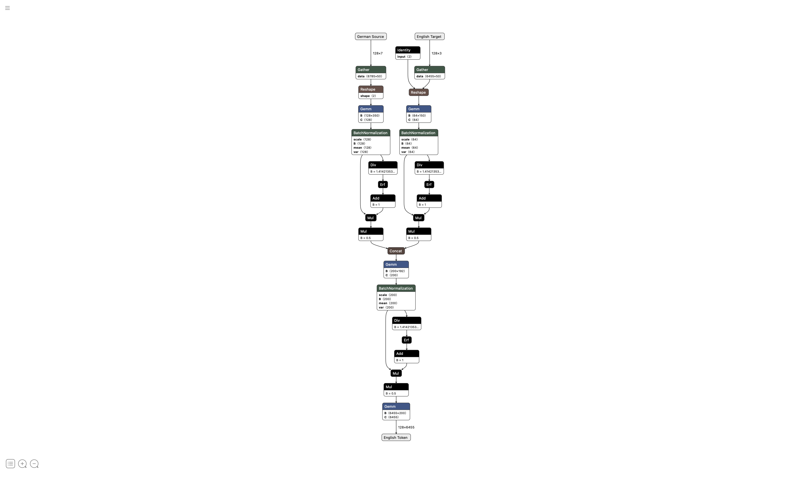

# Machine Translation
Machine translation project for the SPP 'Machine Translation' by RWTH computer science department i6 in the summer semester 2023. <br>
## Creators: <br>
<ul>
    <li>Andreas Pletschko : andreas.pletschko@rwth-aachen.de
    <li>Lukas Vierling : lukas.vierling@rwht-aachen.de
    <li>Glen Grant : glen.grant@rwth-aachen.de
    <li>Justus Peretti : justus.peretti@rwth-aachen.de
</ul>

## Supervisors: <br>
<ul>
    <li>Benedikt Hilmes
    <li>Prof. Dr.-Ing. Hermann Ney
</ul>

## Results
| Model | BLEU | 
|----------|----------|
| Feed Forward Model  |   0.213  | 
| RNN Encoder Decoder Model | 0.322 |

## Usage
To train the Feed-forward model, execute the following command:
```
python main.py train ff
```
Or train the recurrent model with:
```
python main.py train rnn
```
You can either pass hyperparameters as arguments with the python script, e.g. :
```
python main.py train rnn --epoch 10 --optimizer adam
```
Alternatively, you can provide a predefined YAML config file:
```
python main.py train rnn --config <path to config file>
```
To train an existing model, use the following command:
```
python main.py train rnn --model_dir <path to model> --optimizer_dir <path to optimizer>
```
To evaluate a model, use the following command:
```
python main.py evaluate rnn --path_to_folder <path to folder with model checkpoints> --model_type <model type, rnn or ff> --dest_path <path where the BLEU scores will be stored>
```
To translate text with a trained model, use the following command:
```
python decode.py --model_type <rnn or ff> --model_path <path to model> --source_path <path to source>
```

## Part 1
Scoring methods are important for machine translation because they provide a way to measure the accuracy and quality of the translation output. This helps to identify areas of improvement and evaluate the performance of different translation models. Additionally, scoring methods are necessary to compare the translation output to the reference or human-generated translations, which is essential for benchmarking and evaluation of machine translation systems.<br>
Implementation of several scoring methods to compare hypothesis and references. <br>
<ul>
    <li>WER (<b>W</b>ord <b>E</b>rror <b>R</b>ate)
    <li>PER (<b>P</b>osition-independent <b>E</b>rror <b>R</b>ate)
    <li>BLEU (<b>B</b>i<b>l</b>ingual <b>E</b>valuation <b>U</b>nderstudy)
    <li>Levenshtein-Distance
</ul>

## Part 2
Byte Pair Encoding (BPE) is a tokenization algorithm that splits words into subwords based on their frequency in a given text corpus. BPE is an important preprocessing step for many NLP tasks, as it can reduce the vocabulary size and improve model performance. In addition, batching is a crucial technique for efficient training of neural networks, as it allows for parallel processing of multiple input samples. Together, BPE and batching can significantly improve the speed and accuracy of NLP models, making them more practical and scalable for real-world applications. For example, BERT, one of the most successful NLP models, utilizes BPE and batching to achieve state-of-the-art results on a variety of NLP benchmarks, demonstrating the importance of these techniques for the advancement of natural language understanding.<br>
Implementation of several preprocessing steps.<br>
<ul>
    <li><b>B</b>yte <b>P</b>air <b>E</b>ncoding (BPE)
    <li>A Dictionary
    <li>Batch Function
</ul>

## Part 3
A first simple neural model for translating from German to English sentences is implemented. Model is implemented using torch, we then write a training script to learn the model's weights.
Finally, we tune the model's hyperparameters and experiment with different architectures to achieve the best possible perplexity on dev set.
<ul>
    <li>Training on batches created in Part 2
    <li>Saving and loading models
    <li>Evaluating model on development data periodically
    <li>Printing architecture of the model
    <li>Learning rate scheduling
    <li>Hyper parameter tuning
</ul>



## Part 4
With the use of the obtained translation model, we now perform search to employ the model in a real-world translation scenario. We first implement a scoring function, that -- given a model and source/target sentence pairs -- calculates a score for how likely the model predicts the given target sentence from each source sentence. Speaking, we implement the greedy and beam search algorithms for decoding aswell as a early stopping functionality in our training script. Finally, we evaluate our own model on real translation tasks with the newly implemented search methods. 
<ul>
    <li>Scoring function to calculate a given model's score of a source/target sentence pairs
    <li>Searching algoriths, featuring greedy search and beam search
    <li>Decoding interface that the user can interact with to input into the system
    <li>Early Stopping
    <li>Automatically evaluating a folder of model checkpoints with BLEU
    <li>Examining the BLEU values with our self-implemented model
</ul>

## Part 5
RNNs are crucial in encoder-decoder structures for machine translation due to their ability to capture sequential dependencies. Unlike FNNs, RNNs excel at modeling contextual information, making them more suitable for variable-length input sequences. Their recurrent nature enables them to retain memory of past inputs, capturing long-range dependencies and improving translation quality. RNNs with attention mechanisms dynamically focus on relevant information, aligning source and target languages for better translations. Compared to simple FNNs, RNNs in encoder-decoder structures achieve more accurate and fluent machine translations.

## Part 6
To enhance the performance of our model we did some hyperparameter tuning. Hyperparemter tuning is an essential part of machine learning, as it allows us to find the best possible configuration for our model. We used the following hyperparameters:
<ul>
    <li>Number of layers
    <li>Number of hidden units
    <li>Size of embedding layer
    <li>Dropout rate
    <li>Batch size
    <li>BPE encoding
    <li>Layer normalization
    <li>Gradient clipping
    <li>Teacher forcing
</ul>

